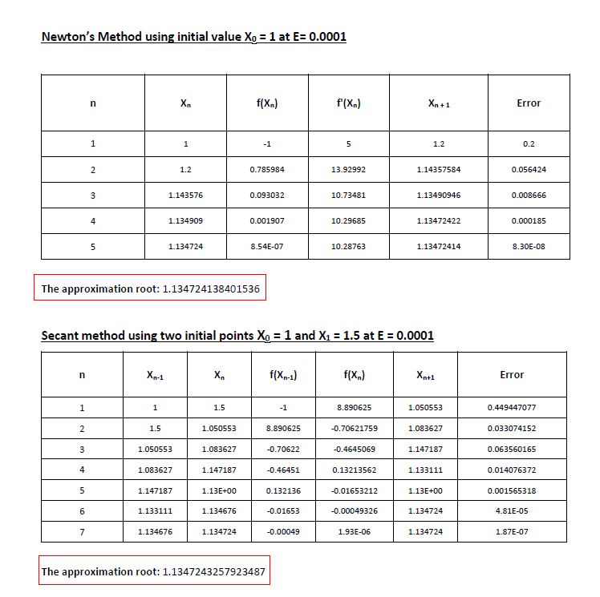
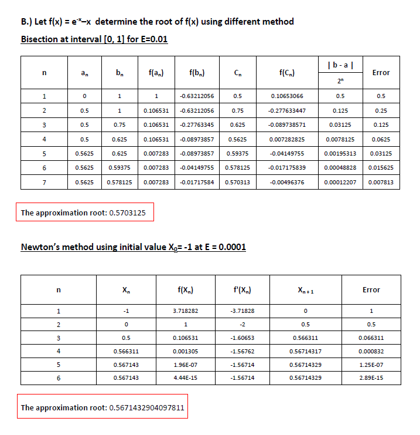

# Root-Finding Algorithms using Recursion

The Root-Finding is a process involves finding a root, or solution of an equation of the form f(x) = 0, for a given function f. A root of this equation is also called a zero of the function f. The finding algorithms are Bisection, Newton's Rhapsody, and Secant method for finding the root of the function and each methods use recursion. 

## Sample Problem

 
 
